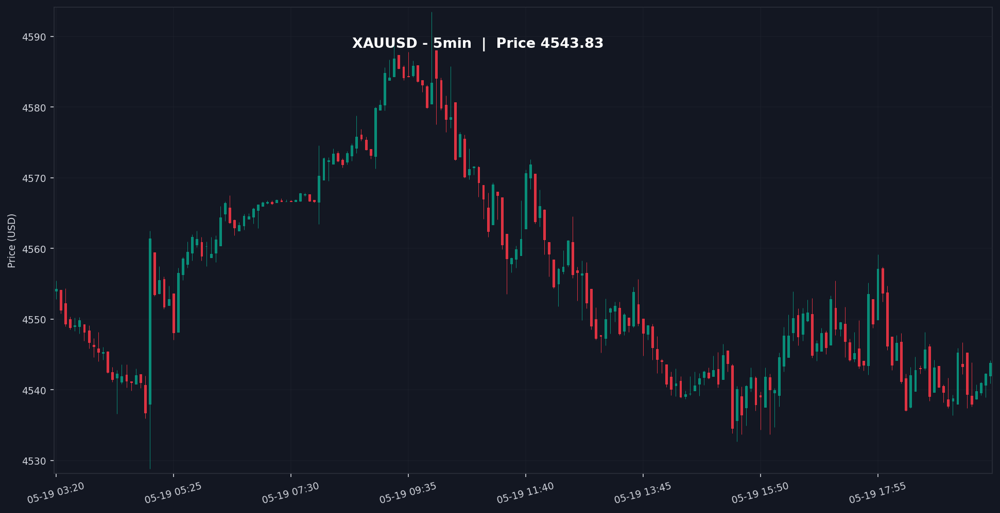

<div align="center">

# 🤖 Smart-Money AI Trading Engine

### _aka **AlgoFlow** — trade **with** the algorithm, not against it._

**An AI-powered signal engine that reads the market the way institutions do — Quarterly Theory, Smart Money Concepts, FVGs, and liquidity — then delivers a precise, ready-to-execute trade plan straight to your Telegram.**

<br/>


</div>

---

## 📑 Table of Contents

- [💡 Overview](#-overview)
- [✨ Features](#-features)
- [⚙️ How It Works](#️-how-it-works)
- [📟 Output Example](#-output-example)
- [🧰 Tech Stack](#-tech-stack)
- [🚀 Installation & Usage](#-installation--usage)
- [🔧 Configuration](#-configuration)
- [⚠️ Disclaimer](#️-disclaimer)
- [📄 License](#-license)

---

## 💡 Overview

> **Most retail traders draw lines on a chart. Smart money draws liquidity.**

Traditional trading bots chase lagging indicators and arbitrary support/resistance — the same retail map that institutions trade *against*. **Smart-Money AI Trading Engine** flips the script.

This engine fuses a **deterministic algorithmic core** with **AI vision analysis**:

- 🧮 A hard-coded **Quarterly Theory** module computes the institutional reference levels — Yearly, Monthly, Weekly, and Daily Opens (TYO / TMO / TWO / TDO) — the price anchors algorithms actually pivot around.
- 👁️ A **Claude vision model** then reads a live, TradingView-style chart against your own documented Smart-Money playbook to spot **Fair Value Gaps, liquidity sweeps, order blocks, and premium/discount zones**.
- 📨 The result is a single, structured, **execution-ready signal** — bias, point of interest, entry type, stop, target — delivered with a chart snapshot to Telegram.

📈 **The philosophy:** stop guessing tops and bottoms. Trade **time and price** alongside the algorithm.

---

## ✨ Features

- 🤖 **Automated Signal Generation** — Deep, repeatable market analysis runs on schedule and outputs a complete trade plan with **zero manual charting**.
- 🧭 **Comprehensive Market Context** — Every signal explains the **Bullish / Bearish** state with layered reasoning: a **macro bias** (yearly/Quarterly) and a **micro bias** (weekly/daily) grounded in **Time & Price**.
- 🎯 **Points of Interest (POI)** — Surfaces the zones that matter: **Premium / Discount** ranges, **unmitigated FVGs**, and resting **liquidity pools**.
- 🎚️ **Precise Order Execution** — Recommends the exact entry mechanic — **Limit / Market / Buy Stop / Sell Stop** — with a defined **Stop Loss** and a **Take Profit that targets opposing liquidity**, plus the **R:R** and a **confidence score**.
- 🖼️ **Beautiful Visual Output** — A clean, dark-theme **TradingView-style candlestick snapshot** is rendered and delivered **inline with a formatted alert** — no broken images, no clutter.
- 🥇 **Gold-First, Built for ICT/SMC** — Tuned for **XAUUSD** as the flagship instrument, designed around Inner Circle Trader / Smart Money methodology.

---

## ⚙️ How It Works

| Step | Stage | What Happens |
|:----:|:------|:-------------|
| 1️⃣ | **Data Ingestion** | Pulls OHLCV from **MetaTrader 5** (primary, Windows) with automatic fallback to **TwelveData** (Docker/Linux). |
| 2️⃣ | **Quarterly Levels** | `logic.py` computes the institutional anchors — **TYO, TMO, TWO, TDO**. |
| 3️⃣ | **Chart Rendering** | `chart_generator.py` renders a **5-minute TradingView-style** candlestick PNG (dark theme). |
| 4️⃣ | **AI Vision Analysis** | The chart + your **`Research/`** Smart-Money notes are sent to **Claude** for FVG / liquidity / order-block reading. |
| 5️⃣ | **Structured Signal** | The engine assembles bias, POI, entry, SL, TP, R:R and confidence into one alert. |
| 6️⃣ | **Delivery** | Signal + chart pushed to **Telegram** — automatically, **daily at 08:00 (Asia/Jerusalem)**. |

---

## 📟 Output Example

> A live signal delivered to Telegram looks like this 👇

```text
🚨 SMART-MONEY SIGNAL — XAUUSD 🚨
────────────────────────────────────
📊 Signal:        SHORT
🧭 Macro Bias:    Bearish  (price trading in yearly Premium, below TYO)
🔬 Micro Bias:    Bearish  (weekly liquidity swept, displacement down)
🎯 POI:           15m Fair Value Gap (unmitigated)  →  2,418.50 – 2,421.10

🎚️ Entry Type:    SELL LIMIT  @  2,419.80
🛑 Stop Loss:     2,424.60        (above 15m FVG + buy-side liquidity)
🎯 Take Profit:   2,402.30        (opposing sell-side liquidity / Discount)
⚖️ Risk : Reward: 1 : 3.6
📈 Confidence:    High (82%)

🧠 Reasoning:
Price swept Asian-session highs into Premium, left an unmitigated 15m
FVG, and showed bearish displacement away from TWO. Bias favors a
return to the FVG before the next leg toward Discount liquidity.
────────────────────────────────────
🕗 Generated: 2026-05-19 08:00 (Asia/Jerusalem)
```

_...accompanied by a rendered TradingView-style 5m chart snapshot:_

<div align="center">



_Live 5-minute XAUUSD chart auto-generated by the engine (dark TradingView theme)._

</div>

---

## 🧰 Tech Stack

| Component | Technology |
|:----------|:-----------|
| 🐍 **Language / Runtime** | Python **3.11** (async) |
| 🧠 **AI Engine** | Anthropic **Claude** (vision) |
| 📡 **Market Data** | **MetaTrader 5** → **TwelveData** fallback |
| 📊 **Charting** | `mplfinance` (TradingView dark theme) |
| 📨 **Delivery** | `python-telegram-bot` |
| ⏰ **Scheduler** | `APScheduler` (daily cron) |
| 🐳 **Deployment** | Docker / Docker Compose |

---

## 🚀 Installation & Usage

### 1️⃣ Clone the repository

```bash
git clone https://github.com/<your-username>/smart-money-ai-engine.git
cd smart-money-ai-engine
```

### 2️⃣ Install dependencies

```bash
pip install -r requirements.txt
```

> 💡 `MetaTrader5` installs on **Windows** only. On Linux/macOS/Docker the engine auto-routes to the **TwelveData** fallback.

### 3️⃣ Create your `.env`

```bash
TELEGRAM_TOKEN=your_telegram_bot_token
CHAT_ID=your_telegram_chat_id
ANTHROPIC_API_KEY=your_anthropic_api_key
TWELVEDATA_API_KEY=your_twelvedata_api_key

# Optional
TZ=Asia/Jerusalem
LOG_LEVEL=INFO
# MT5_LOGIN=...
# MT5_PASSWORD=...
# MT5_SERVER=...
```

### 4️⃣ Run it

**Local (Python):**

```bash
python main.py
```

**Docker (recommended for 24/7):**

```bash
docker-compose up -d
```

> 🗂️ Drop your personal Smart-Money strategy notes/screenshots into the **`Research/`** folder — the engine feeds them to the AI as ground-truth context.

---

## 🔧 Configuration

| Variable | Required | Description |
|:---------|:--------:|:------------|
| `TELEGRAM_TOKEN` | ✅ | Telegram Bot API token |
| `CHAT_ID` | ✅ | Destination chat / channel ID |
| `ANTHROPIC_API_KEY` | ✅ | Claude API key (vision analysis) |
| `TWELVEDATA_API_KEY` | ✅ | TwelveData key (data fallback) |
| `TZ` | ⬜ | Timezone (default `Asia/Jerusalem`) |
| `LOG_LEVEL` | ⬜ | Logging verbosity |
| `MT5_LOGIN` / `MT5_PASSWORD` / `MT5_SERVER` | ⬜ | MetaTrader 5 account (Windows) |

---

## ⚠️ Disclaimer

> **This software is for educational and research purposes only. It is _not_ financial advice.**
> Trading leveraged instruments carries substantial risk of loss. Automated signals can be wrong. You are solely responsible for your own decisions and capital. Never trade money you cannot afford to lose.

---

## 📄 License

Released under the **MIT License**. See [`LICENSE`](LICENSE) for details.

<div align="center">

<br/>

**⭐ If this engine sharpens your edge, drop a star.**

_Built for traders who follow the algorithm._ 🤖📈

</div>
